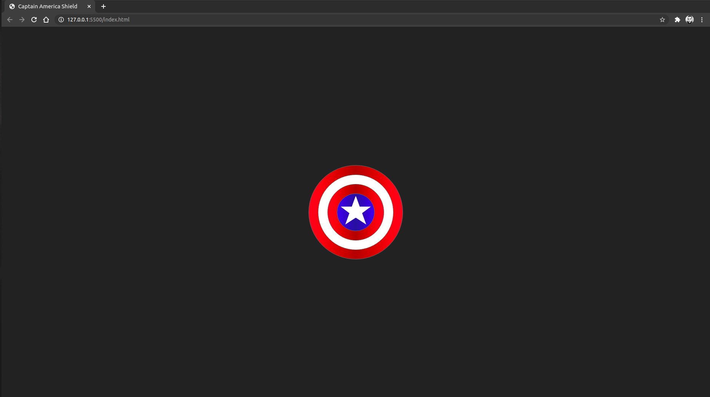
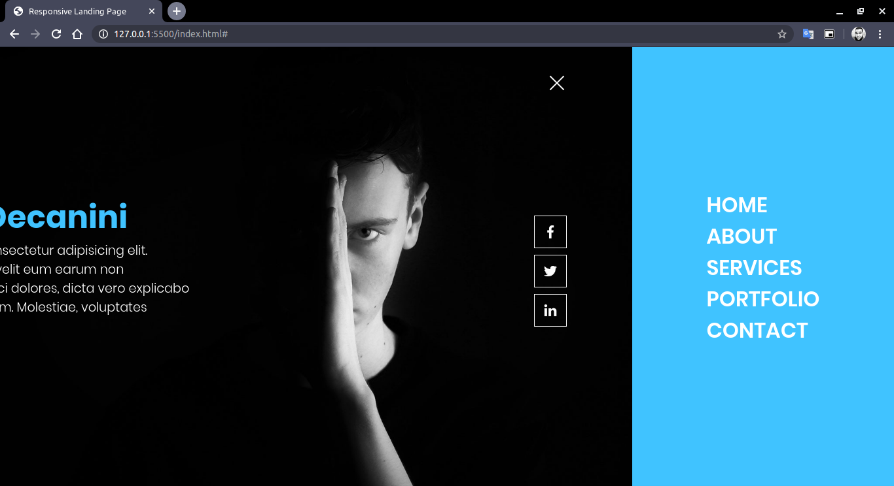

# 🌐 Responsive Landing Page

<p align="center">
  <a href="https://github.com/antoniodecanini">
    
  </a>

  
</p>

This landing page, was raised to studding front-end development, this idea was
withdrawn from an example of youtube channel, and I implemented this.

<p align="center">
  

  
</p>

---

## 🚀 Getting Started

### Prerequisites
- To execute this project, you just need a browser of your choice.

### Step 1 - 👯 Clone this repo to your local machine and install dependencies
```
$ git clone https://github.com/antoniodecanini/responsive-landing-page-vanillaJS.git

$ cd responsive-landing-page-vanillaJS
```

### Step 2 - 🔗 Open site (with Google Chrome for example)
```
$ google-chrome index.html
```

---

## 📋 Features

### Build with

- Core
  - [HTML](https://developer.mozilla.org/en-US/docs/Web/HTML) - is the most basic building block of the Web. It defines the meaning and structure of web content.
  - [CSS](https://developer.mozilla.org/en-US/docs/Web/CSS) - is a stylesheet language used to describe the presentation of a document written in HTML or XML (including XML dialects such as SVG, MathML or XHTML). CSS describes how elements should be rendered on screen, on paper, in speech, or on other media.
  - [JavaScript](https://developer.mozilla.org/en-US/docs/Web/JavaScript) - is a lightweight, interpreted, or just-in-time compiled programming language with first-class functions.

---

## 📝 License


This project is licensed under the MIT License - see the [LICENSE](LICENSE) file for details.

---

Made with ❤️ Enjoy it!