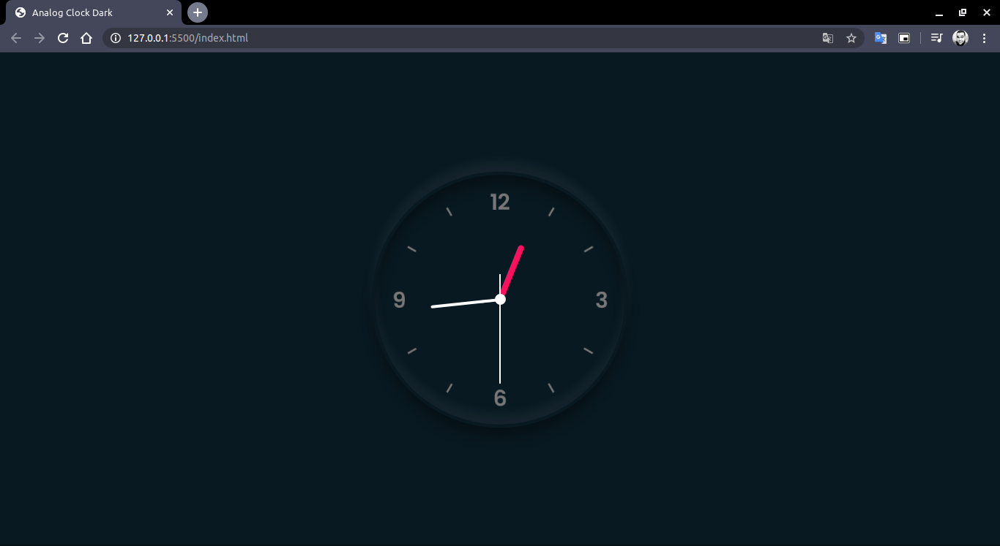

# 🕐 Analog Clock

  

  

This analog clock, was raised to studding front-end development, focusing in CSS neumorphism and rotate items, this idea was withdrawn from an example of youtube channel, and I implemented this.

  

---

## 📋 Features

### Build with

- Core
  - [HTML](https://developer.mozilla.org/en-US/docs/Web/HTML) - is the most basic building block of the Web. It defines the meaning and structure of web content.
  - [CSS](https://developer.mozilla.org/en-US/docs/Web/CSS) - is a stylesheet language used to describe the presentation of a document written in HTML or XML (including XML dialects such as SVG, MathML or XHTML). CSS describes how elements should be rendered on screen, on paper, in speech, or on other media.
  - [JavaScript](https://developer.mozilla.org/en-US/docs/Web/JavaScript) - is a lightweight, interpreted, or just-in-time compiled programming language with first-class functions.

---

## 📝 License

This project is licensed under the MIT License - see the [LICENSE](LICENSE) file for details.

---

Made with ❤️ Enjoy it!
